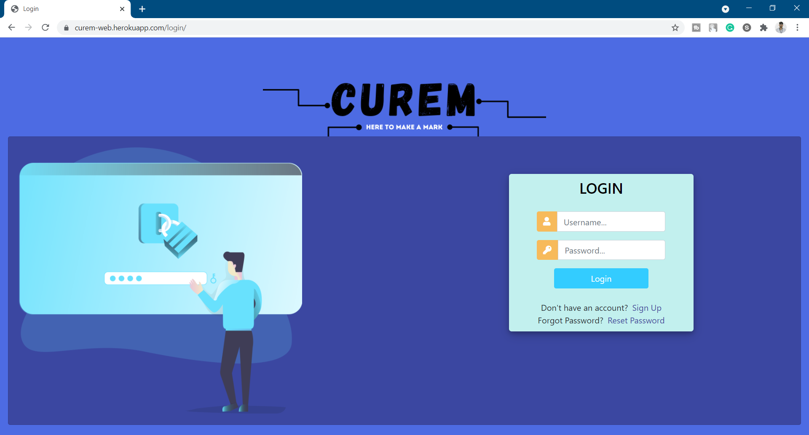
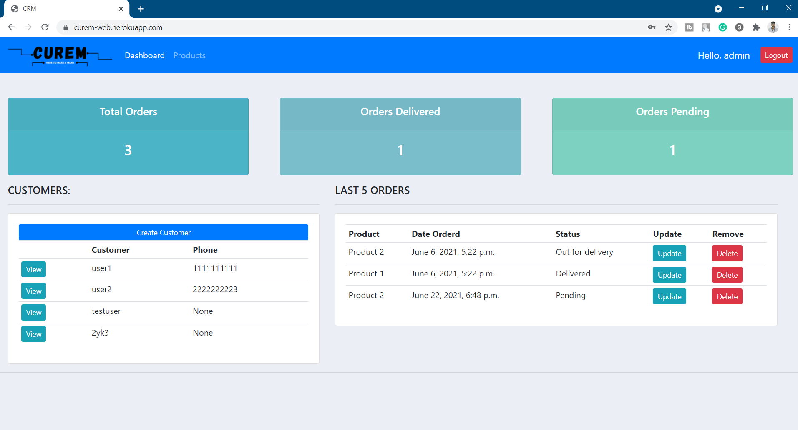
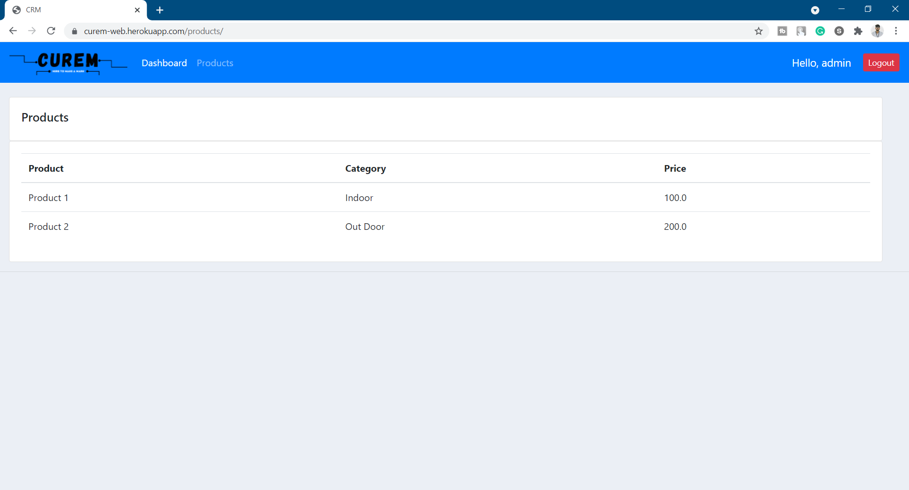
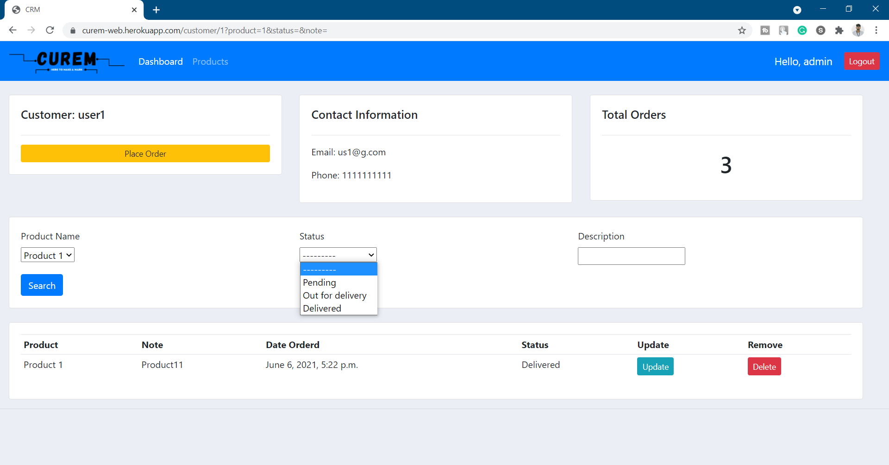
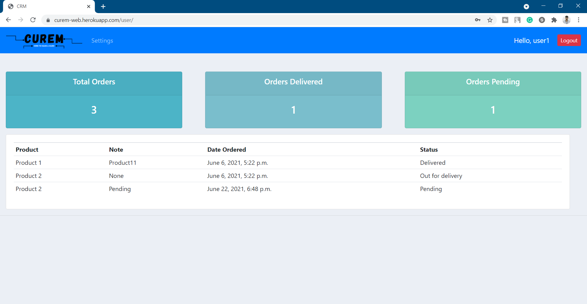
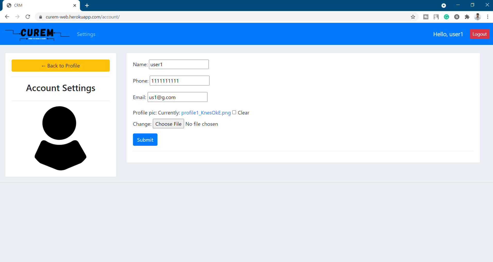

# CUREM

# Project Demo:

[Demo](curem-web.herokuapp.com/)

# Sample Login:

1. User Login:

--> username: user1

--> password: us@12345

 

# Project Screenshots:

### User Login

 
 
 

### Admin Dashboard

 
 
 

### Admin Product Section

 
 
 

### Admin customize/view user order

 
 
 

### User Dashboard

 
 
 

### User Profile Settings

 
 
 

# Technology Stack:

1. Front-End:

--> HTML

--> CSS

--> Javascript

--> Bootstrap 4

 

2. Back-End:

--> Django

--> Postgresql

--> AWS RDS and S3

 

# Want to have a hands on with code, follow the steps given below:

## Pipenv Installation

 
Check if your system has pipenv, if not run:

### `pip install pipenv`

 

## Project environment setup

 
For importing the libraries & creating your vnenv, in the project directory, run:

### `pipenv install`

### `pipenv shell`

 

## You are ready to go!

 

Just go into the base app and run the project with:

### `python manage.py runserver`
